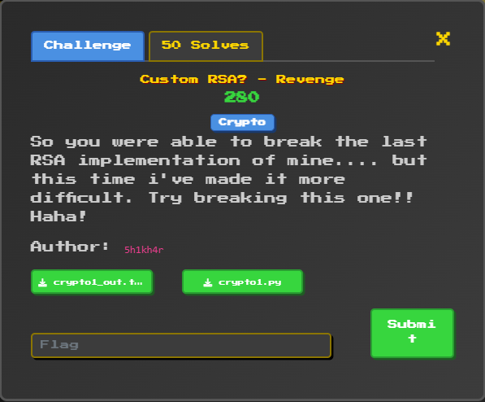

# CustomRSA revenge

## Description

<figure><figcaption></figcaption></figure>


## Solution

1. Analyzed

* In this challenge, you can see a huge hole when you expose `mod_phi = (p-1)(q-1)(e-1)` ,we can completely bruteforce the intervals to find e and from there get `phi = (p-1)(q-1)`&#x20;
* After get `phi`, we use **Viète Theorem** to solve the problem:

$$
\begin{cases}
t = p+q \\
phi = pq-(p+q)+1=n-t+1 
\end{cases} \Rightarrow \ t=n-phi+1
$$

* `p` and `q` are two solutions of this function.

$$
X^{2}-tX+n=0
$$

* After find `p, q` we can find the plaintext easily.


2. Script

```python
from math import isqrt
from Crypto.Util.number import long_to_bytes, inverse, isPrime

mod_phi = 381679521901481226602014060495892168161810654344421566396411258375972593287031851626446898065545609421743932153327689119440405912     # mod_phi
n = 1236102848705753437579242450812782858653671889829265508760569425093229541662967763302228061        # n
c = 337624956533508120294617117960499986227311117648449203609049153277315646351029821010820258         # c

approx = mod_phi // n            
for off in range(-10000, 10001):
    e = approx + off + 1   
    if not isPrime(e): 
        continue
    A = e - 1
    if mod_phi % A: 
        continue
    k = mod_phi // A
    t = n + 1 - k
    D = t*t - 4*n
    if isqrt(D)**2 == D:
        p = (t + isqrt(D)) // 2
        q = (t - isqrt(D)) // 2
        phi = (p-1)*(q-1)
        d = inverse(e, phi)
        m = long_to_bytes(pow(c, d, n))
        print(m)       
        break
```

```
Blitz{Cust0m_RSA_OMGGG}
```

