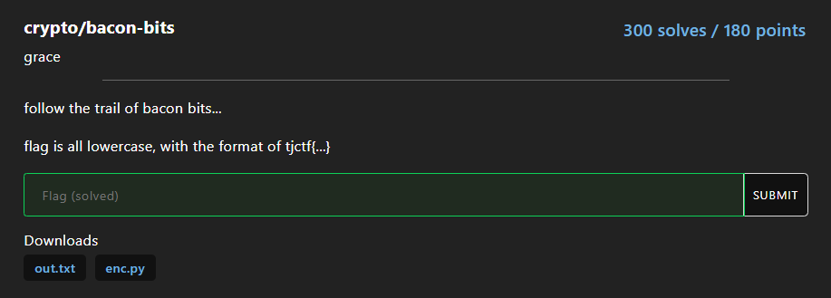

# bacon-bits
## Description


[enc.py](enc.py)

[out.txt](out.txt)

## Analyzed 
1. Đề bài đọc file `text.txt` mà ta chưa có, tuy nhiên đoạn `out.txt` chính là đoạn `text.txt` sau khi ROT13

2. Từ đây ta có thể tìm được `text.txt` sau đó mã hóa ngược lại để tìm được `flag.txt`

3. Để ý một chút trong `baconian` ta thấy `i` và `j` có cùng giá trị `01000` cho nên khi ra kết quả ta có thể thử thay đổi 2 chữ cái

## Solution
1. Đầu tiên ta cần tìm được `text.txt`
```python
f = open('out.txt','r')
out = f.read()
pre_out = ''.join([chr(ord(i)+13) for i in out])
print(pre_out)
```

Từ đây ta có đoạn `text.txt`
```plain
OncEupOnatimeThEreWasaDuDuPOnAtImethERewaSadUdEOnCeUPoNaTimetHErewAsaDuDEoNcEUpOnATiMeThereWAsadUdeOnCEuPoNAtImEThErEWaSaDudeoNCeupOnaT
```

2. Theo `enc.py` ta thấy mỗi kí tự trong flag sẽ chuyển thành các kí tự nhị phân trong `baconian` sau đó lấy 5 kí tự trong `text.txt`, cuối cùng nếu vị trí kí tự đó trùng với số 1 thì in ra chữ hoa, trùng với số 0 thì in ra chữ thường. Cho nên ta dễ dàng chuyển lại các kí tự trong `text.txt` về mã nhị phân 
Sau khi chuyển về mã nhị phân, ta chuyển đổi lại bằng `baconian` và sẽ có FLAG

```python
ciphertext = "OncEupOnatimeThEreWasaDuDuPOnAtImethERewaSadUdEOnCeUPoNaTimetHErewAsaDuDEoNcEUpOnATiMeThereWAsadUdeOnCEuPoNAtImEThErEWaSaDudeoNCeupOnaT"
new = []

for i in ciphertext:
    if i.isupper():
        new.append(1)
    else:
        new.append(0)

def group_bits_to_ints(bits):
    grouped = []
    for i in range(0, len(bits), 5):
        group = bits[i:i+5]
        value = "".join(map(str, group)) 
        grouped.append(value)
    return grouped

sos = group_bits_to_ints(new)

baconian_rev = {v: k for k, v in baconian.items()}

for i in range(len(sos)):
    sos[i] = baconian_rev[sos[i]]

sos = ''.join(sos)
print(sos)
```

Kết quả chính là: 
```plain
tjctfojnkoojnkooojnkoooojnk
```

Sau khi chỉnh sửa 2 chữ cái `i, j` và thêm kí tự ngoặc ta có được FLAG

```plain
tjctf{oinkooinkoooinkooooink}
```
