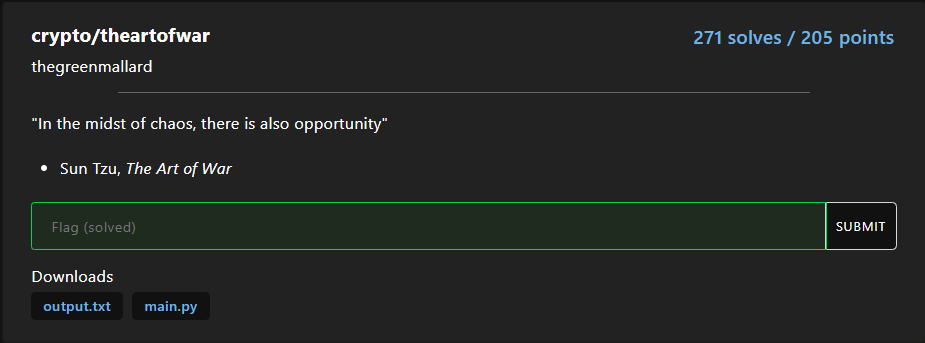

## theartofwar
### Descripiton


[main.py](main.py)

[output.txt](output.txt)

### Analyzed
1. Phân tích một chút về hàm tạo khóa
   - Chỉ để phi_N và e nguyên tố cùng nhau
2. Về hàm mã hóa:
   - Tạo ra e lần n và c cho nên có thể sử dụng định lý thặng dư Trung Hoa để giải quyết bài toán
3. Định lý thặng dư Trung Hoa
- Định lý: Cho $m_1,m_2,...,m_n$ các cặp đôi một nguyên tố cùng nhau $(m_i,m_j)=1$  và một hệ gồm $n$ phương trình
  
```math
\left\{\begin{array}{1}
x\equiv a_1\ (mod\ m_1)\\
x\equiv a_2\ (mod\ m_2)\\
...\\
x\equiv a_n\ (mod\ m_n)
\end{array}\right.
```
có một nghiệm duy nhất module $M$ với $M = m_1.m_2....m_n$
- Lấy $b_i = \frac{M}{m_i}$ và $b_i^{'} \equiv b_i^{-1}\ (mod\ m_i)$ thì ta tìm được nghiệm $x$ duy nhất bằng công thức
```math
x = \sum_{i=1}^n a_i.b_i.b_i^{'}\ (mod\ M)
```
- Ta xây dựng nghiệm $x$ theo tổng của các số hạng $t_i$ và $t_i$ đáp ứng các tiêu chí:
    - Đáp ứng phương trình chính nó : $t_i \equiv a_i(mod\ m_i)$
    - Là tích của các module $m_j$ với $j \ne i$ để tránh trường hợp trùng đồng dư với các $t_j$ khác
```math
t_i \equiv a_i\ (mod\ m_i) \Rightarrow
t_i \equiv 0\ (mod \ m_j) \ \forall \ j \ne\ i
```
- Ta có: $t_i = a_i.b_i$ , tuy nhiên sau khi nhân với $b_i$ thì $t_i$ không còn đồng dư $a_i$ theo module $m_i$ nữa, cho nên ta cần tìm một số $k$ sao cho:
```math
a_i.b_i.k\equiv a_i\ (mod\ m_i)\\
\Rightarrow b_i.k \equiv 1\ (mod\ m_i)
```
- Mà ta có $(b_i,m_i)=1$ cho nên tìm $k$ là hoàn toàn có thể $(b_i^{'})$
Cho nên công thức tìm nghiệm chính là:
```math
x = \sum_{i=1}^n t_i \ (mod\ M)= \sum_{i=1}^n a_i.b_i.b_i^{'}\ (mod\ M)
```
  
### Solution
Từ những phân tích ở trên ta sẽ đọc `output.txt` các giá trị `n`,`c` vào các mảng và thực hiện thuật toán
```python
from Crypto.Util.number import *
from gmpy2 import iroot
n = []
c = []
e = None

with open("output.txt", "r") as f:
    for line in f:
        line = line.strip()
        if line.startswith("e ="):
            e = int(line.split("=")[1].strip())
        elif line.startswith("n"):
            n.append(int(line.split("=")[1].strip()))
        elif line.startswith("c"):
            c.append(int(line.split("=")[1].strip()))

def extended_gcd(a:int,b:int)->int:
    x0, x1, y0, y1 = 1, 0, 0, 1
    while b!= 0:
        q, a, b = a // b, b, a % b
        x0, x1 = x1, x0 - q * x1
        y0, y1 = y1, y0 - q * y1
    return x0, y0

def modular_inverse(a:int,m:int)->int:
    x,y = extended_gcd(a,m)
    return (x%m)

def CRT(a: list, m:list)->int:
	M = 1
	for i in range(len(a)):
		M = M*m[i]

	p = [M//m[i] for i in range(len(m))]
	p1 = [modular_inverse(p[i],m[i]) for i in range(len(m))]
	result=0
	for i in range(len(a)):
		result = result + p[i]*p1[i]*a[i]
	return result%M 

m_pow_e = CRT(c, n)
m = iroot(m_pow_e, e)[0]
print(long_to_bytes(int(m)).decode())
```
Sau khi chạy xong ta có FLAG: 
```plain
tjctf{the_greatest_victory_is_that_which_require_no_battle}
```
