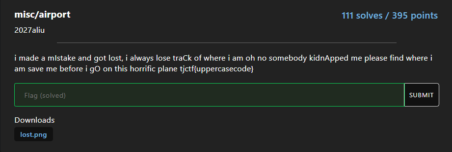
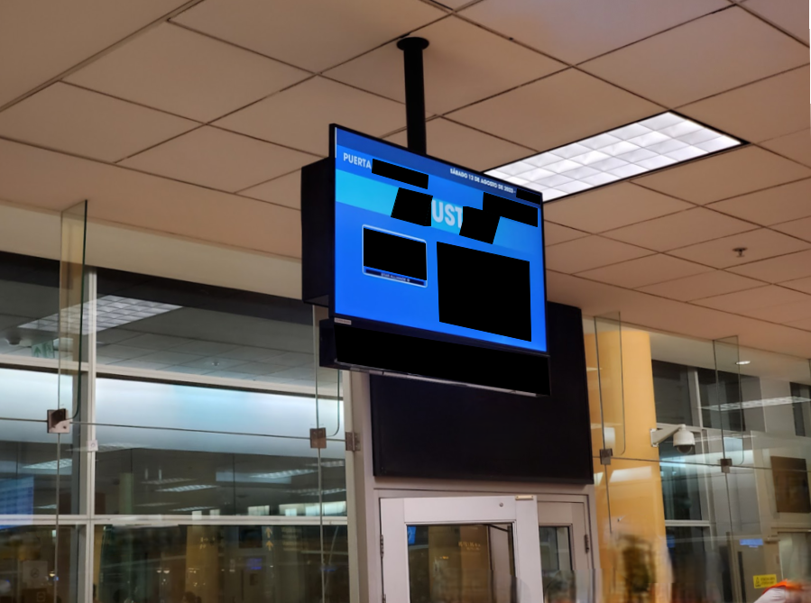

# airport
## Description


[lost.png](lost.png)

## Analyzed


Phân tích hình ảnh ta có thể thấy được dòng chữ tiếng Tây Ban Nha ở mép trên màn hình bên phải, ta sẽ có được list các quốc gia sử dụng tiếng Tây Ban Nha như:
- Tây Ban Nha
- Mexico
- Peru
- Argentina
- Chile
- Colombia
- ...

- Bên cạnh đó trên đề bài có các chữ cái I C A O viết hoa ghép lại thành ICAO (International Civil Aviation Organization) là một hệ thống mã quốc tế do Tổ chức Hàng không Dân dụng Quốc tế (ICAO) quy định để xác định các sân bay, hãng hàng không và các cơ quan liên quan đến hàng không dân dụng. Mã ICAO được sử dụng trong các giao dịch và tài liệu liên quan đến hàng không để đảm bảo tính chính xác và đồng nhất quốc tế.

## Solution
Ta sử dụng Wikipedia để liệt kê các sân bay cùng với tên viết tắt của một số nước trên và thử FLAG:
Dưới đây là mã ICAO của một số sân bay ở các quốc gia nói tiếng Tây Ban Nha:

1. Argentina
    - Aeropuerto Internacional Ministro Pistarini (Ezeiza) - SAEZ
    - Aeropuerto Internacional Jorge Newbery (Buenos Aires) - SABE

2. Mexico
   - Aeropuerto Internacional Benito Juárez (Mexico City) - MMMX
   - Aeropuerto Internacional de Cancún - MMUN

3. Spain
   - Aeropuerto Adolfo Suárez Madrid-Barajas (Madrid) - LEMD
   - Aeropuerto de Barcelona-El Prat (Barcelona) - LEBL
   - Aeropuerto de Málaga-Costa del Sol (Málaga) - LEMG

4. Chile
   - Aeropuerto Internacional Comodoro Arturo Merino Benítez (Santiago) - SCEL
   - Aeropuerto de Antofagasta (Cerro Moreno) - SAVT

5. Colombia
    - Aeropuerto Internacional El Dorado (Bogotá) - SKBO
    - Aeropuerto Internacional José María Córdova (Medellín) - SKRG

6. Peru
   - Aeropuerto Internacional Jorge Chávez (Lima) - SPJC
   - Aeropuerto Internacional Alejandro Velasco Astete (Cusco) - SPZO

Cuối cùng ta thử các mã ICAO vào và có được FLAG
```plaintext
tjctf{SPJC}
```
