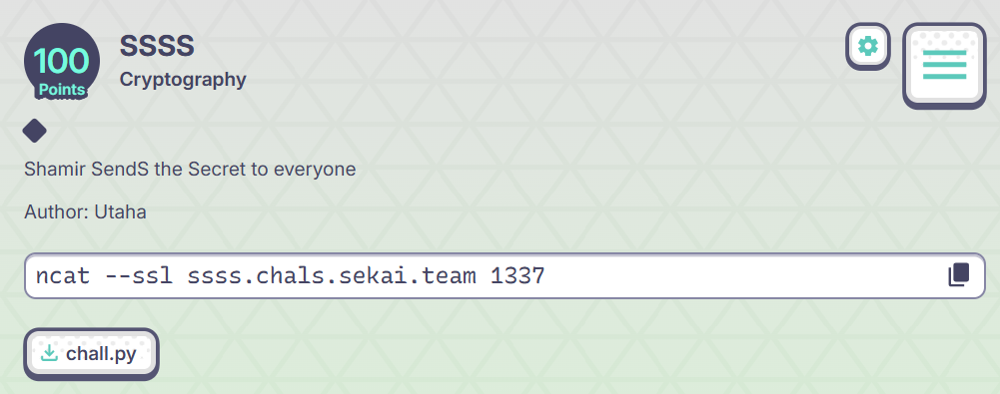

# crypto-SSSS

## Description

<figure><figcaption></figcaption></figure>


## Solution

```python
#!/usr/bin/env python3
import socket, ssl
from typing import List, Tuple, Set

HOST = "ssss.chals.sekai.team"
PORT = 1337

p = 2**256 - 189
t = 29  # the only t in [20,50] that divides p-1

def modinv(a: int) -> int:
    return pow(a, p-2, p)

def find_zeta(order: int) -> int:
    """Return an element of exact order 'order' modulo p (order | p-1)."""
    assert (p-1) % order == 0
    exp = (p-1) // order
    # Try a few small bases until we hit one with zeta != 1 (then order is exactly 'order').
    for base in [2,3,5,7,11,13,17,19,23,29,31,37,41,43,47,53]:
        z = pow(base, exp, p)
        if z != 1:
            # Sanity check: z^order == 1
            if pow(z, order, p) != 1:
                raise RuntimeError("Bad zeta candidate")
            return z
    raise RuntimeError("Could not find zeta")

def inverse_dft_coeffs(evals: List[int], zeta: int) -> List[int]:
    """
    Given y_j = f(zeta^j) for j=0..t-1 and deg f <= t,
    recover c'_k = (1/t) * sum_j y_j * zeta^{-k j}  (k = 0..t-1).
    Then c'_0 = c_0 + c_t, and for k=1..t-1 we get c_k exactly.
    """
    assert len(evals) == t
    inv_t = modinv(t)
    zinv = modinv(zeta)
    coeffs = [0]*t
    # Precompute powers for speed
    zinv_pows = [1]*t
    for k in range(1, t):
        zinv_pows[k] = (zinv_pows[k-1] * zinv) % p

    for k in range(t):
        # current multiplier is zeta^{-k} raised to j, i.e., (zinv^k)^j
        zinv_k = pow(zinv, k, p)
        acc = 0
        cur = 1
        for j in range(t):
            acc = (acc + evals[j] * cur) % p
            cur = (cur * zinv_k) % p
        coeffs[k] = (acc * inv_t) % p

    # coeffs[0] == c0 + ct; coeffs[1..t-1] == c1..c_{t-1}
    return coeffs

def send_line(sock, s: str) -> None:
    if not s.endswith("\n"):
        s += "\n"
    sock.sendall(s.encode())

def recv_line(sock) -> str:
    buf = b""
    while not buf.endswith(b"\n"):
        chunk = sock.recv(1)
        if not chunk:
            break
        buf += chunk
    return buf.decode(errors="ignore")

def one_round(sock, zeta: int) -> Tuple[List[int], str]:
    """Run one challenge round: send t and the 29th roots, read evals, return coeffs and last line seen."""
    send_line(sock, str(t))
    roots = [pow(zeta, j, p) for j in range(t)]
    evals = []
    last = ""
    for x in roots:
        send_line(sock, str(x))
        line = recv_line(sock).strip()
        last = line
        # Some deployments may echo or add prompts — skip non-numeric lines until we get a number.
        while not line or not line[0].isdigit():
            line = recv_line(sock).strip()
            last = line
        evals.append(int(line))
    coeffs = inverse_dft_coeffs(evals, zeta)
    return coeffs, last

def main():
    zeta = find_zeta(t)
    context = ssl.create_default_context()
    with socket.create_connection((HOST, PORT)) as sock:
        with context.wrap_socket(sock, server_hostname=HOST) as s:
            # Round 1: gather coefficients; intentionally guess wrong to get Round 2.
            coeffs1, _ = one_round(s, zeta)
            # Wrong guess on purpose (almost surely not the secret)
            send_line(s, "0")
            _ = recv_line(s)  # likely ":<"
            # Round 2:
            coeffs2, _ = one_round(s, zeta)

            set1: Set[int] = set(coeffs1[1:])  # c1..c28
            set2: Set[int] = set(coeffs2[1:])  # c1..c28

            inter = list(set1.intersection(set2))
            if len(inter) != 1:
                # Extremely rare: secret was at degree 0 or t in both rounds (prob ~ (2/30)^2).
                # Fall back: just pick something (will likely fail); user can rerun the script.
                print("[!] Could not uniquely determine the secret from two rounds.")
                guess = 0
            else:
                guess = inter[0]

            send_line(s, str(guess))
            # Print whatever the server returns (should include the flag if we guessed right)
            try:
                while True:
                    out = recv_line(s)
                    if not out:
                        break
                    print(out, end="")
            except Exception:
                pass

if __name__ == "__main__":
    main()

```
