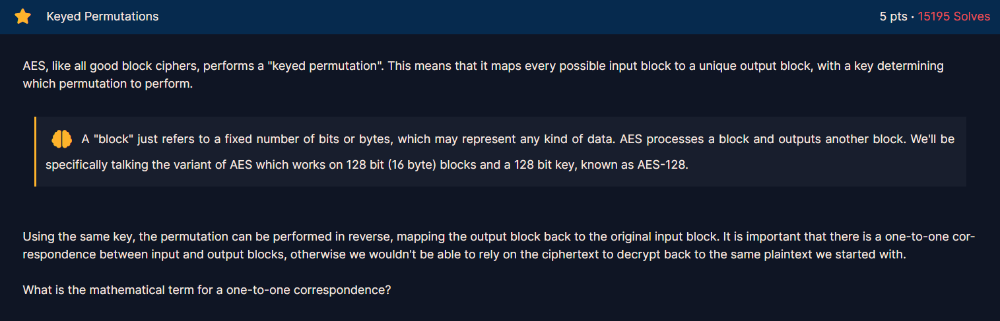

# Keyed Permutations

## Description

<figure><figcaption></figcaption></figure>


## Solution

The mathematical term for a one-to-one correspondence is **bijection**.


## Flag

```
crypto{bijection}
```

